# 💧 AquaSmart — Yapay Zeka Destekli Akıllı Sulama Sistemi

<p align="center">
  <a href="https://fastapi.tiangolo.com/">
    
  </a>
  <a href="https://react.dev/">
    
  </a>
  <a href="https://scikit-learn.org/">
    
  </a>
  <a href="https://groq.com/">
    
  </a>
  <a href="https://open-meteo.com/">
    
  </a>
</p>

> Hava tahminlerine körü körüne güvenmek yerine, **her tarlanın geçmişinden öğrenen bir yapay zeka** ile en doğru sulama kararını veren akıllı tarım platformu.

---

## 📋 Proje Hakkında

**AquaSmart**, çiftçilerin tarlalarını en az su ile en doğru zamanda otomatik olarak sulamasını sağlayan yapay zeka destekli bir akıllı sulama sistemidir.

Hava durumu servisleri "yarın yağmur yağacak" dediğinde, AquaSmart buna körü körüne güvenmez. Bunun yerine her tarla için ayrı bir **Random Forest Classifier** modeli eğiterek, geçmiş 60 günlük veriyi analiz eder ve **"Bu tarlaya gerçekten yağmur gelir mi?"** sorusunu cevaplar. Böylece çiftçi gereksiz yere sulama yapmaz ya da sahte tahmine güvenip bitkisini kaybetmez.

- **Frontend**: React 19 + React Router DOM + Axios
- **Backend**: FastAPI + Python + SQLAlchemy
- **Yapay Zeka (ML)**: Scikit-Learn — Random Forest Classifier (tarla bazlı)
- **Chatbot**: Groq API — LLaMA 3.3 70B Versatile
- **Hava Durumu**: Open-Meteo API (gerçek zamanlı + 48 saatlik tahmin)
- **Veritabanı**: SQLite
- **Zamanlayıcı**: APScheduler (saatlik otomatik kontrol)

---

## 🖼️ Ekran Görüntüleri

### 1. Giriş Sayfası
Su damlası formunda tasarlanmış login ekranı. Kullanıcı e-posta ve şifre yazdıkça damla dolum animasyonu çalışır.

<p align="center">
  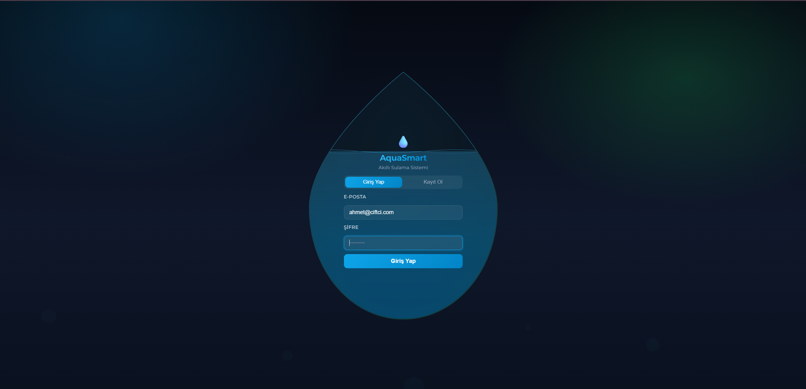<br/>
  <em>Giriş Sayfası</em>
</p>

### 2. Dashboard — Ana Sayfa
Toplam kar, kazanılan su, aktif sulama durumu ve sonraki planlı sulama bilgisi tek bakışta görülür. Tüm tarlaların anlık analizi otomatik yapılır.

<p align="center">
  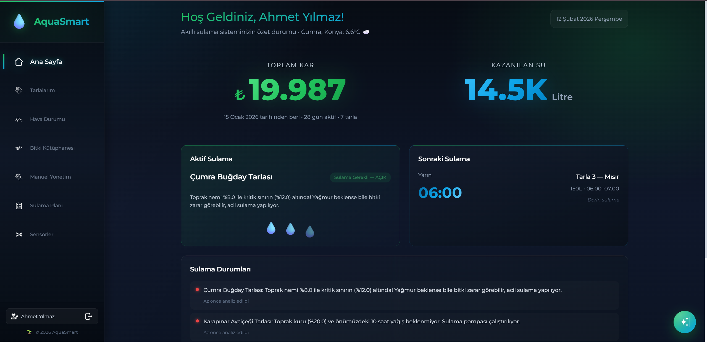<br/>
  <em>Dashboard</em>
</p>

### 3. Tarlalarım ve Tarla Detayı
Tüm tarlaların nem, sıcaklık, durum badge'i ve tahmini gelir bilgisi kartlarla listelenir. Detay modalında bitki değiştirme, pompa debisi, su birim fiyatı ve nem eşikleri görüntülenir.

<p align="center">
  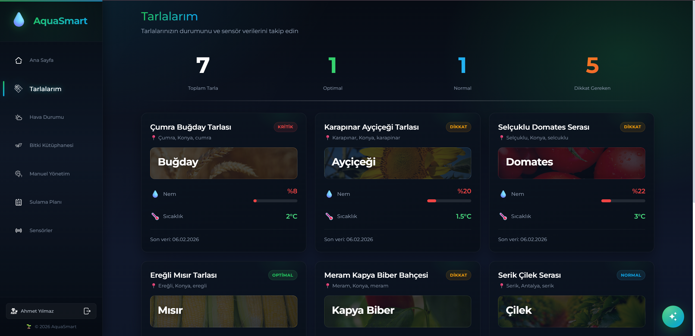
  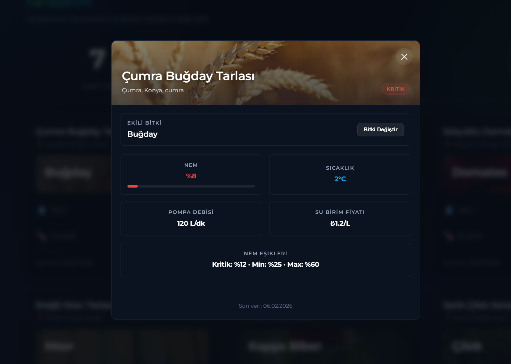
  <br/>
  <em>Tarlalarım Listesi ve Tarla Detay Modalı</em>
</p>

### 4. Hava Durumu
Her ilçe için Open-Meteo API'den çekilen gerçek zamanlı hava verileri, animasyonlu kartlarla gösterilir. 5 günlük tahmin, don riski ve yağış uyarıları sunulur.

<p align="center">
  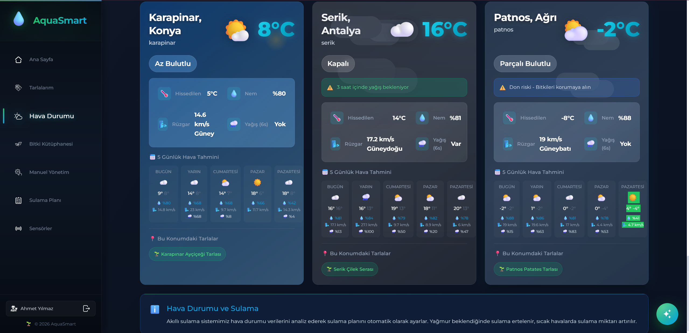<br/>
  <em>Hava Durumu Sayfası</em>
</p>

### 5. Bitki Kütüphanesi
8 bitki türünün aranabilir grid görünümü ve detay modalı. Ekim/hasat zamanı, su ihtiyacı, toprak tipi, nem eşikleri ve uzman yetiştirme tüyoları.

<p align="center">
  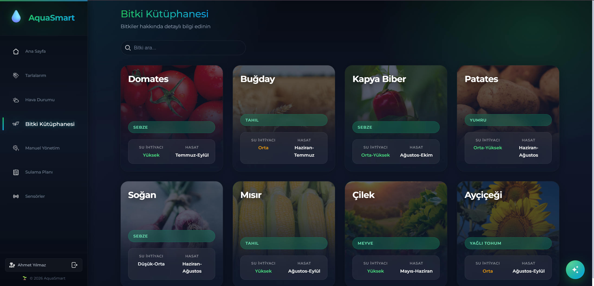
  
  <br/>
  <em>Bitki Kütüphanesi ve Bitki Detay Modalı</em>
</p>

### 6. Manuel Yönetim
Çiftçi herhangi bir tarlayı seçip süre ayarlayarak manuel sulama başlatabilir. Tarla seçildiğinde backend'den akıllı sulama tavsiyesi otomatik çekilir.

<p align="center">
  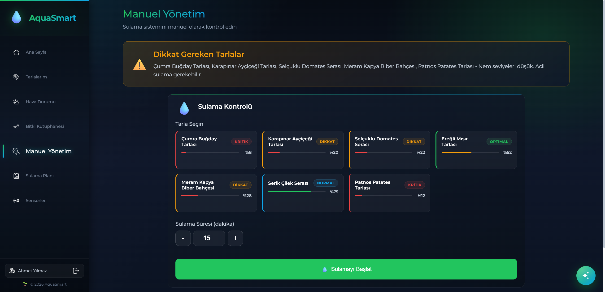<br/>
  <em>Manuel Yönetim Sayfası</em>
</p>

### 7. Sulama Planı
Tarla bazlı haftalık sulama takvimi. Her slot için başlangıç-bitiş saati, su miktarı, süre ve not bilgisi. Bugünün planı otomatik vurgulanır.

<p align="center">
  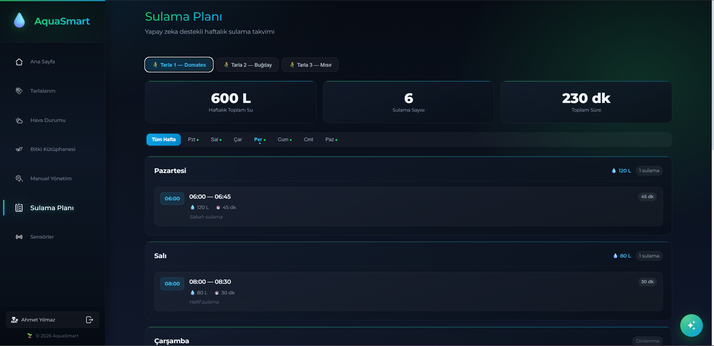<br/>
  <em>Sulama Planı Takvimi</em>
</p>

### 8. Sensörler
Tüm sensör cihazlarının durumu, pil seviyesi, son veri zamanı ve anlık değerleri tablo formatında. Durum bazlı filtreleme ve sistem sağlık yüzdesi.

<p align="center">
  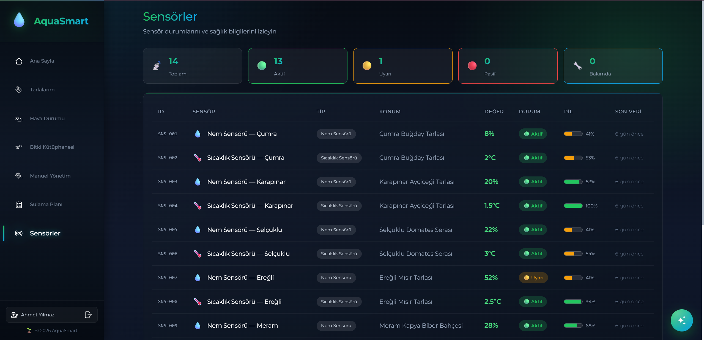<br/>
  <em>Sensörler Sayfası</em>
</p>

### 9. AI Tarım Danışmanı (Chatbot)
LLaMA 3.3 70B destekli chatbot, önce tarla seçtirir ardından 11 farklı veri kaynağını toplayarak kişiselleştirilmiş tarım danışmanlığı sunar.

<p align="center">
  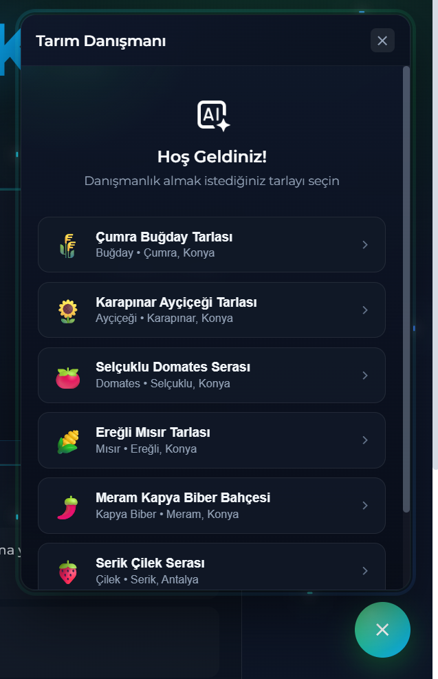
  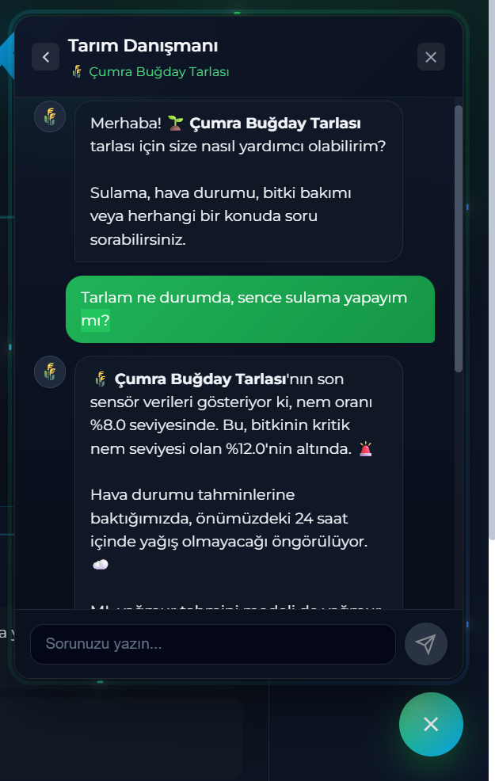
  <br/>
  <em>Tarla Seçimi ve AI Sohbet Ekranı</em>
</p>

---

## 🧠 Yapay Zeka: Hava Tahmini Doğrulama (Random Forest Classifier)

Bu projenin en kritik ve fark yaratan özelliği: **Hava tahmininin güvenilirliğini tarla bazında doğrulayan makine öğrenmesi sistemi.**

### Nasıl Çalışır?

Hava durumu servisi "yarın yağmur yağacak" diyor. Peki bu tarlaya **gerçekten** yağacak mı?

Sistem, her tarla için **bağımsız bir Random Forest Classifier modeli** eğitir. Model, son 60 günlük verideki hava tahmini ile gerçek yağış olaylarını karşılaştırarak öğrenir:

> *"Bu tarlada, hava tahmini son 60 günde 241 kez yağmur demiş. Kaç tanesinde gerçekten yağmur yağmış? Sadece 13 tanesinde — yani tahmin %95 güvenilmez!"*

Ya da tam tersi:

> *"Bu tarlada hava tahmini yağmur dediğinde %83 oranında gerçekten yağmış. Tahmine güven, sulamayı ertele, su tasarrufu yap!"*

### Model Mimarisi

- **Algoritma**: Random Forest Classifier (100 karar ağacı, `max_depth=12`, `class_weight=balanced`)
- **Eğitim/Test Bölümü**: %80 eğitim / %20 test (stratified split)
- **Doğruluk**: %89 – %96 (tarla bazında değişir)
- **Model Değerlendirme**: Accuracy, F1-Score, Classification Report, Feature Importance

### 14 Feature (Özellik)

| Feature | Açıklama |
|---------|----------|
| `moisture` | Anlık toprak nemi (%) |
| `temperature` | Ortam sıcaklığı (°C) |
| `rain_probability` | Hava tahmininin yağmur olasılığı |
| `expected_rain_amount` | Beklenen yağış miktarı (mm) |
| `tahmin_yagmur_diyor` | Hava tahmini yağmur diyor mu? (binary) |
| `son_tahmin_isabeti` | Son 10 tahminin isabet oranı (rolling accuracy) |
| `hour`, `hour_sin`, `hour_cos` | Günün saati (ham + çevrimsel kodlanmış) |
| `month`, `month_sin`, `month_cos` | Yılın ayı (ham + çevrimsel kodlanmış) |
| `day_of_year`, `day_of_week` | Mevsimsel ve haftalık örüntüler |

### 4 Sulama Kararı

| Karar | Anlamı |
|-------|--------|
| **GÜVEN_BEKLE** | Hava tahmini yağmur diyor ve ML de doğruluyor → Sulamayı ertele, su tasarrufu yap |
| **GÜVENME_SULA** | Hava tahmini yağmur diyor ama geçmişte bu tarlaya gelmemiş → Tahmine güvenme, sula |
| **DİKKAT_SÜRPRİZ** | Hava tahmini yağmur demiyor ama ML sürpriz yağmur olasılığı görüyor → Dikkat |
| **NORMAL_SULAMA** | Ne hava tahmini ne ML yağmur beklemiyor → Normal programa devam |

---

## 💧 Akıllı Sulama Karar Mekanizması (5 Katmanlı)

Sistem sulama kararını tek bir koşula değil, **5 farklı senaryoya** göre verir:

| Senaryo | Durum | Sistem Davranışı |
|---------|-------|------------------|
| **KRİTİK NEM** | Toprak nemi hayatta kalma sınırının altında | Yağmur bile olsa **acil sula**. ML güvenmiyorsa **savunmacı mod**: sadece minimum seviyeye suluyor |
| **DÜŞÜK NEM** | Toprak kuru ama henüz kritik değil | 1/3/6 saat içinde yağmur var mı kontrol + ML doğrulama. Güvenilirse **ertele**, güvenilmezse **yarım doz** |
| **AŞIRI ISLAK** | Toprak çok nemli | Sulama durdurulur, **kök çürümesi** riski uyarısı |
| **İDEAL** | Nem ideal aralıkta | Sulama gerekmiyor |
| **MALİYET OPT.** | Pompa debisi + su fiyatı ile hesaplama | ML sayesinde gereksiz sulamalar önlenir → **%30-48 su tasarrufu** |

---

## 🤖 AI Chatbot — Tarım Danışmanı

Çiftçi, sisteme entegre chatbot üzerinden doğal dilde soru sorabilir. Chatbot, soruya cevap vermeden önce tarla hakkında **11 farklı veri kaynağını** toplayıp yapay zekaya bağlam olarak gönderir:

1. Tarla bilgileri (konum, ilçe, koordinat, pompa debisi, su fiyatı)
2. Bitki bilgileri (nem sınırları, su ihtiyacı, ekim/hasat zamanı, uzman tüyoları)
3. Son 10 sensör verisi (nem, sıcaklık, yağmur durumu)
4. Sensör cihazlarının durumu ve batarya seviyesi
5. Son 5 sulama kaydı (süre, su miktarı, maliyet)
6. Veritabanındaki hava tahminleri
7. Anlık hava durumu (Open-Meteo canlı veri)
8. 24 saatlik saatlik hava tahmini
9. ML yağmur tahmin doğrulama sonucu
10. Akıllı sulama karar sistemi çıktısı
11. Son bildirimler

**Kullanılan Model**: Groq API üzerinden LLaMA 3.3 70B Versatile

---

## 🌤️ Gerçek Zamanlı Hava Durumu Entegrasyonu

Sistem, **Open-Meteo API** kullanarak gerçek hava verileri çeker:

- **30+ Türkiye ilçesi** desteklenir (Konya, Antalya, Ağrı, İstanbul, İzmir, Ankara ve daha fazlası)
- **Anlık hava durumu**: Sıcaklık, hissedilen sıcaklık, nem, rüzgar hızı/yönü, hava kodu
- **48 saatlik saatlik tahmin**: Her saat için sıcaklık, yağış olasılığı, beklenen yağış miktarı
- **WMO hava kodları** Türkçeye çevrilir (☀️ Açık, 🌧️ Hafif Yağmur, ❄️ Kar, ⛈️ Fırtına...)
- **Hava durumuna göre animasyonlu kartlar**: Güneşli, yağmurlu, karlı, fırtınalı, sisli vb. her durum için ayrı CSS animasyonu
- Önümüzdeki 1/3/6 saat içinde yağış var mı otomatik hesaplanır

---

## ⏰ Saatlik Otomatik Kontrol (Cron Job)

APScheduler kullanılarak **her saat başı** otomatik olarak:

1. Tüm tarlalar taranır
2. Her tarla için ML tahmin doğrulama yapılır
3. Sonuca göre kullanıcıya **otomatik bildirim** oluşturulur:
   - ⚠️ *"Hava tahmini yağmur diyor ama geçmiş veriye göre bu tarlaya gelmeyebilir"*
   - 🌧️ *"Yağmur tahmini güvenilir, sulama ertelendi"*
   - 🤔 *"Beklenmeyen yağmur olasılığı var, dikkat!"*

---

## 🌾 Bitki Kütüphanesi (8 Bitki Türü)

Gerçek tarımsal araştırmalarla hazırlanmış bitki profilleri:

| Bitki | Kategori | Su İhtiyacı | Kritik Nem | İdeal Sıcaklık | Su Miktarı |
|-------|----------|-------------|------------|----------------|------------|
| 🍅 Domates | Sebze | Yüksek | %10 | 20-30°C | 600-800 mm/sezon |
| 🌾 Buğday | Tahıl | Orta | %12 | 15-25°C | 400-600 mm/sezon |
| 🌶️ Kapya Biber | Sebze | Orta-Yüksek | %15 | 20-30°C | 500-700 mm/sezon |
| 🥔 Patates | Yumru | Orta-Yüksek | %15 | 15-22°C | 500-700 mm/sezon |
| 🧅 Soğan | Sebze | Düşük-Orta | %12 | 13-24°C | 350-500 mm/sezon |
| 🌽 Mısır | Tahıl | Yüksek | %15 | 18-30°C | 500-800 mm/sezon |
| 🍓 Çilek | Meyve | Yüksek | %20 | 15-26°C | 500-700 mm/sezon |
| 🌻 Ayçiçeği | Yağlı Tohum | Orta | %10 | 18-28°C | 400-500 mm/sezon |

Her bitki için ekim zamanı, hasat zamanı, uygun toprak tipi ve uzman yetiştirme tüyoları mevcuttur.

---

## 📡 Sensör Yönetim Sistemi

- **Nem sensörleri** — Toprak nemini ölçer (%)
- **Sıcaklık sensörleri** — Ortam sıcaklığını ölçer (°C)
- Her sensörün **batarya seviyesi**, **durumu** (aktif / uyarı / bakımda / pasif), **son veri zamanı** izlenir
- Durum bazlı filtreleme ve sensör sağlık özeti
- Toplam **24 sensör cihazı** 12 tarlaya dağıtılmış durumda

---

## 🗺️ 3 İklim Bölgesi × 12 Test Senaryosu

Sistem, Türkiye'nin farklı iklim bölgelerini simüle eder:

| Bölge | İklim | Özellik |
|-------|-------|---------|
| **Konya** | Step | Kuru, sert kış, sıcak yaz |
| **Antalya** | Akdeniz | Ilıman, yağışlı kış |
| **Ağrı** | Karasal | Çok soğuk, don, kuraklık |

12 tarlanın her biri farklı bir karar senaryosunu kanıtlamak için özel veri desenine sahiptir:

| # | Tarla | Senaryo | Açıklama |
|---|-------|---------|----------|
| 1 | Çumra Buğday | KRİTİK NEM | Nem %8 — Konya kuraklığı |
| 2 | Karapınar Ayçiçeği | ML GÜVENME | Tahmin %5 isabet — sahte yağmur tahmini |
| 3 | Selçuklu Domates | ML GÜVEN | Tahmin %83 isabet — sulamayı ertele |
| 4 | Ereğli Mısır | İDEAL | Nem %52 — düzenli bakım |
| 5 | Meram Biber | DÜŞÜK NEM | Nem %28 — sulama gerekli |
| 6 | Serik Çilek | AŞIRI ISLAK | Nem %75 — Antalya yağışı |
| 7 | Patnos Patates | KRİTİK SAVUNMACI | Nem %12 — Ağrı don riski |
| 8 | Akşehir Soğan | İDEAL | Nem %40 — düzenli |
| 9 | Kumluca Domates | MALİYET TASARRUFU | ML ile maliyet 5.4₺ → 2.7₺/gün |
| 10 | Cihanbeyli Buğday | SÜRPRİZ YAĞMUR | Beklenmeyen yağış deseni |
| 11 | Doğubayazıt Buğday | KRİTİK NEM | Nem %9, -8°C — sert kış |
| 12 | Beyşehir Çilek | İDEAL | Nem %55 — göl kenarı mikroklima |

---

## 🛠️ Kullanılan Teknolojiler

### Frontend

| Teknoloji | Açıklama |
|-----------|----------|
| **React 19** | Kullanıcı arayüzü |
| **React Router DOM** | Sayfa yönlendirme |
| **Axios** | HTTP istekleri |
| **Context API** | Kimlik doğrulama durumu yönetimi |
| **CSS3 Animasyonlar** | Hava durumu, su damlası, glow efektleri |

### Backend

| Teknoloji | Açıklama |
|-----------|----------|
| **FastAPI** | Modern Python web framework |
| **SQLAlchemy** | ORM — veritabanı modelleri ve ilişkiler |
| **SQLite** | Hafif, kurulum gerektirmeyen veritabanı |
| **Pydantic** | Veri doğrulama şemaları |
| **APScheduler** | Saatlik arka plan görevleri |
| **python-dotenv** | Çevre değişkenleri yönetimi |

### Makine Öğrenmesi

| Teknoloji | Açıklama |
|-----------|----------|
| **Scikit-Learn** | Random Forest Classifier eğitimi ve tahmin |
| **Pandas** | Veri manipülasyonu ve feature engineering |
| **NumPy** | Sayısal hesaplamalar ve çevrimsel kodlama |
| **Joblib** | Model serialization (.pkl dosyaları) |

### API Entegrasyonları

| Servis | Açıklama |
|--------|----------|
| **Open-Meteo** | Gerçek zamanlı hava durumu + 48 saatlik tahmin |
| **Groq** | LLaMA 3.3 70B dil modeli (chatbot) |

---

## 🚀 Kurulum

### Gereksinimler

- **Python** (3.10+)
- **Node.js** (v16+)
- **Groq API Key** (chatbot için)

### 1) Depoyu Klonlayın

```bash
git clone https://github.com/BurakYucelPY/ANKARA-AI-HACKATHON-2026.git
cd ANKARA-AI-HACKATHON-2026
```

### 2) Backend Kurulumu

```bash
# Sanal ortam oluştur
python -m venv venv

# Windows
venv\Scripts\activate

# Gerekli paketleri yükle
pip install -r requirements.txt

# .env dosyası oluştur ve Groq API anahtarını ekle
echo GROQ_API_KEY=your_groq_api_key_here > .env

# Veritabanını oluştur ve demo verilerle doldur
python seed_db.py

# Bitki türlerini yükle (sunucu çalışırken)
# POST http://localhost:8000/plant-types/seed

# ML modellerini eğit (sunucu çalışırken)
# POST http://localhost:8000/prediction/train-all

# Backend'i başlat
uvicorn main:app --reload
```

Backend `http://localhost:8000` adresinde çalışacaktır.

### 3) Frontend Kurulumu

```bash
cd frontend

# Bağımlılıkları yükle
npm install

# Development sunucusunu başlat
npm start
```

Frontend `http://localhost:3000` adresinde çalışacaktır.

### 4) Demo Giriş Bilgileri

| Kullanıcı | E-posta | Şifre | Tarla Sayısı |
|-----------|---------|-------|--------------|
| Ahmet | ahmet@ciftci.com | ahmet123 | 7 tarla |
| Fatma | fatma@ciftci.com | fatma123 | 3 tarla |
| Mehmet | mehmet@ciftci.com | mehmet123 | 2 tarla |

---

## 📁 Proje Yapısı

```
ANKARA-AI-HACKATHON-2026/
├── main.py                        # FastAPI uygulama giriş noktası + saatlik cron job
├── database.py                    # SQLAlchemy veritabanı bağlantısı
├── models.py                      # Veritabanı modelleri (7 tablo)
├── schemas.py                     # Pydantic doğrulama şemaları
├── seed_db.py                     # Demo veri üretici (12 tarla, 60 gün, 3 iklim)
├── .env                           # API anahtarları (git'e eklenmez)
├── ml/
│   ├── __init__.py
│   └── predictor.py               # ML motoru — eğitim, tahmin, güvenilirlik analizi
├── ml_models/
│   ├── meta.json                  # Tüm modellerin meta bilgileri
│   └── field_*.pkl                # Tarla bazlı eğitilmiş modeller
├── routers/
│   ├── users.py                   # Kullanıcı kayıt/giriş + tarla CRUD
│   ├── plants.py                  # Bitki kütüphanesi + seed endpoint
│   ├── simulation.py              # Akıllı sulama karar mekanizması (5 katmanlı)
│   ├── weather.py                 # Open-Meteo entegrasyonu (anlık + saatlik)
│   ├── prediction.py              # ML model eğitim + tahmin endpoint'leri
│   ├── sensors.py                 # Sensör cihaz yönetimi
│   └── chatbot.py                 # AI tarım danışmanı (Groq LLM)
├── frontend/
│   ├── package.json
│   ├── public/
│   └── src/
│       ├── App.js                 # Router yapısı + korumalı rotalar
│       ├── context/
│       │   └── AuthContext.js     # Kimlik doğrulama state yönetimi
│       ├── services/
│       │   └── api.js             # Backend API çağrıları (Axios)
│       ├── components/
│       │   ├── Layout.js          # Sayfa düzeni (Navbar + içerik)
│       │   ├── Navbar.js          # Kenar çubuğu navigasyon (animasyonlu)
│       │   ├── Card.js            # Tekrar kullanılabilir kart bileşeni
│       │   └── Chatbot.js         # AI chatbot bileşeni (her sayfada erişilebilir)
│       ├── pages/
│       │   ├── Login.js           # Su damlası formunda giriş ekranı
│       │   ├── Dashboard.js       # Ana sayfa — özet, kar, su tasarrufu
│       │   ├── Fields.js          # Tarlalar listesi ve durumları
│       │   ├── FieldDetail.js     # Tarla detay modalı + bitki değiştirme
│       │   ├── Weather.js         # Animasyonlu hava durumu kartları
│       │   ├── PlantLibrary.js    # Bitki kütüphanesi + detay modalı
│       │   ├── ManualControl.js   # Manuel sulama kontrolü
│       │   ├── IrrigationPlan.js  # Haftalık sulama planı takvimi
│       │   └── Sensors.js         # Sensör tablosu ve sağlık durumu
│       ├── data/
│       │   └── plantImages.js     # Bitki görselleri eşleştirme
│       └── assets/                # İkonlar ve bitki görselleri
└── ReadMeImages/                  # README ekran görüntüleri
```

---

## 💡 Nasıl Çalışır?

### 1. Giriş ve Kimlik Doğrulama
Çiftçi, su damlası formundaki giriş ekranından e-posta ve şifre ile giriş yapar. Yazılan her karakter su damlasını doldurur. Oturum bilgileri `localStorage`'da saklanır.

### 2. Dashboard — Anlık Durum Özeti
Giriş yapıldığında tüm tarlalar için otomatik olarak sulama analizi yapılır. Toplam kar, kazanılan su, aktif sulama durumu ve sonraki planlı sulama görüntülenir. Anlık hava durumu header'da gösterilir.

### 3. Tarlalarım — Tarla Yönetimi
Her tarla kendi bitki görseli arka planında, anlık nem ve sıcaklık verileriyle görüntülenir. Kartlarda durum badge'i (Optimal/Dikkat/Kritik), tarla alanı ve tahmini gelir hesaplaması bulunur. Tıklanınca açılan detay modalında bitki değiştirme (şifre ile güvenlik doğrulaması), pompa debisi, su birim fiyatı ve nem eşikleri görülür.

### 4. Hava Durumu — İlçe Bazlı Gerçek Veri
Her tarlanın ilçesine göre Open-Meteo API'den anlık hava durumu ve saatlik tahminler çekilir. Hava koşuluna göre kartlar farklı animasyonlar gösterir (güneş, yağmur, kar, fırtına, sis). 5 günlük tahmin tablolarıyla yağış olasılıkları sunulur. Don riski ve yağış uyarıları otomatik oluşturulur.

### 5. Bitki Kütüphanesi — Tarımsal Bilgi Bankası
8 bitki türünün tamamı, backend'deki araştırılmış verilerden çekilir. Arama özellikli grid görünümü ve detay modalı ile ekim zamanı, su miktarı, toprak tipi, ideal sıcaklık ve uzman tüyoları sunulur. Sulama sistemi için gereken teknik parametreler (min/max/kritik nem, maks bekleme süresi) de gösterilir.

### 6. Manuel Yönetim — Pompa Kontrolü
Çiftçi isterse herhangi bir tarlayı seçip süre ayarlayarak manuel sulama başlatabilir. Tarla seçildiğinde backend'den o tarlanın akıllı sulama tavsiyesi otomatik çekilir ve gösterilir. Dikkat gereken tarlalar uyarı kartıyla vurgulanır.

### 7. Sulama Planı — Haftalık Takvim
Tarla bazlı haftalık sulama planı, gün seçici ve özet kartlarıyla görüntülenir. Her slot için başlangıç-bitiş saati, su miktarı (litre), süre (dakika) ve not bilgisi bulunur. Bugünün planı otomatik vurgulanır.

### 8. Sensörler — Cihaz Sağlık Paneli
Veritabanındaki tüm sensörler tablo formatında listelenir. Durum filtreleme (aktif/uyarı/pasif/bakımda), batarya göstergesi, son veri zamanı ve sensör türüne göre anlık değer gösterilir. Sistem sağlık yüzdesi otomatik hesaplanır.

### 9. AI Chatbot — Kişisel Tarım Danışmanı
Her sayfada erişilebilir chatbot, önce tarla seçtirir sonra o tarlanın 11 farklı veri kaynağını (sensör, hava durumu, ML tahmin, sulama kararı vb.) toplayıp LLaMA 3.3 70B'ye bağlam olarak gönderir. Çiftçi Türkçe doğal dilde soru sorar ve **kişiselleştirilmiş, veriye dayalı** cevaplar alır.

### 10. Otomatik Kontrol — Saatlik Cron Job
Sistem arka planda saatte bir tüm tarlaları kontrol eder, ML tahmin doğrulama yapar ve gerektiğinde kullanıcıya bildirim oluşturur.

---

## 🎯 Örnek Demo Senaryoları

| Tarla | Problem | Sistemin Çözümü |
|-------|---------|-----------------|
| **Karapınar Ayçiçeği** | Hava tahmini sürekli yağmur diyor ama hiç yağmıyor (%5 isabet) | ML: "Bu tahmine güvenme, sula!" → Bitki kurtarıldı |
| **Selçuklu Domates** | Hava tahmini yağmur diyor, gerçekten yağıyor (%83 isabet) | ML: "Güven, bekle!" → Su tasarrufu yapıldı |
| **Kumluca Domates** | Günlük sulama maliyeti yüksek | ML ile maliyet 5.4₺/gün → 2.7₺/gün → **%48 tasarruf** |
| **Doğubayazıt Buğday** | -8°C, nem %9, kritik durum | Sistem: "Acil sula, yağmur bile olsa bekleyemezsin!" |

---

## 🐛 Sorun Giderme

| Sorun | Çözüm |
|-------|-------|
| **ML modeli bulunamadı hatası** | `POST /prediction/train-all` ile tüm modelleri eğitin |
| **Bitki türleri boş** | `POST /plant-types/seed` ile bitki verilerini yükleyin |
| **Chatbot çalışmıyor** | `.env` dosyasında `GROQ_API_KEY` tanımlı olduğundan emin olun |
| **Hava durumu verisi alınamıyor** | İnternet bağlantısını kontrol edin (Open-Meteo erişimi gerekli) |
| **CORS hatası** | Backend'in `http://localhost:8000`'de çalıştığından emin olun |
| **Sensör verisi yok** | `python seed_db.py` ile demo verileri oluşturun |

---

## 📌 Notlar

- **Demo Veri**: `seed_db.py` ile 3 kullanıcı, 12 tarla, 24 sensör, 60 günlük geçmiş veri ve bildirimler otomatik oluşturulur.
- **API Anahtarı**: Chatbot için Groq API key gereklidir. Ücretsiz tier ile çalışır.
- **Hava Verisi**: Open-Meteo API ücretsizdir ve API key gerektirmez.
- **Model Saklama**: Eğitilmiş modeller `ml_models/` klasöründe `.pkl` dosyaları olarak saklanır.
- **Veritabanı**: SQLite kullanılır, `akilli_sulama.db` dosyası otomatik oluşturulur.

---

<p align="center">
  Made with 💧 by
  <a href="https://github.com/BurakYucelPY">Burak Yücel</a> •
  <a href="https://github.com/GurkanGurdal">Gürkan Gürdal</a> •
  <a href="https://github.com/Yusuf-Batuhan-Akpinar">Yusuf Batuhan Akpınar</a>
</p>
